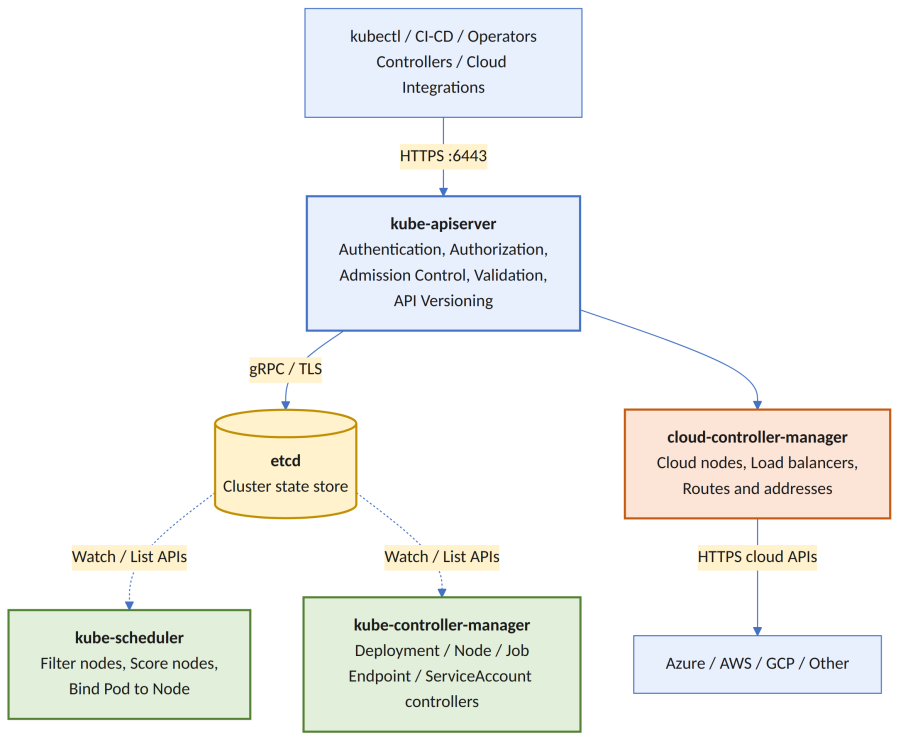

# Kubernetes Control Plane

## Overview

The **Kubernetes Control Plane** is the brain of a Kubernetes cluster. It is responsible for receiving the desired state of the cluster, making scheduling decisions, storing cluster state, and continuously reconciling the actual state with the desired state.

Unlike worker nodes, the control plane **does not normally run application workloads**. Instead, it manages and orchestrates the entire cluster.

The five primary control plane components are:

- **kube-apiserver**
- **etcd**
- **kube-scheduler**
- **kube-controller-manager**
- **cloud-controller-manager** (used with external cloud providers)

> **Note:** Depending on the Kubernetes distribution, these components may run as operating system services, containers, static Pods, or fully managed services (AKS, EKS, GKE).

---

# High-Level Control Plane Architecture



### Key Architectural Principle

The **API Server is the only component that writes cluster state to etcd.**

Although controllers and schedulers continuously observe cluster changes, they **do not communicate directly with etcd**.

Instead, they:

- Watch resources using the Kubernetes API
- Submit updates through the API Server
- Allow the API Server to validate and persist changes into etcd

This makes **kube-apiserver** the central gateway for the entire Kubernetes control plane.

---

# kube-apiserver

## What is kube-apiserver?

The **kube-apiserver** exposes the Kubernetes REST API and acts as the **front door** of the Kubernetes control plane.

Almost every cluster operation flows through the API Server.

It is responsible for:

- Authentication
- Authorization
- Admission Control
- Validation
- API Versioning
- Persisting objects into etcd

---

## Who talks to the API Server?

Almost every Kubernetes component communicates with the API Server.

Examples include:

- kubectl
- Kubernetes Dashboard
- Helm
- Terraform Kubernetes Provider
- Argo CD
- Flux
- kubelet
- kube-scheduler
- kube-controller-manager
- cloud-controller-manager
- Custom Operators
- Admission Webhooks
- External Automation Systems

---

# API Server Request Pipeline

Example command:

```bash
kubectl apply -f deployment.yaml
```

The request flows through the following pipeline:

Lecture02/kubectl-request-path.png

The API Server normally listens on:

| Port | Protocol | Purpose |
|------|----------|---------|
|6443|HTTPS|Secure Kubernetes API|

> In managed Kubernetes services, a Load Balancer, Private Endpoint, or Reverse Proxy may front the API Server.

---

# Authentication

Authentication answers one simple question:

> **Who is making this request?**

Supported authentication methods include:

- X.509 Client Certificates
- Service Account Tokens
- OpenID Connect (OIDC)
- Authentication Webhooks
- Bootstrap Tokens
- External Identity Providers

Example identity:

```text
system:serviceaccount:payments:invoice-processor
```

After successful authentication, Kubernetes knows:

- Username
- Groups
- UID
- Additional identity attributes

> Authentication only establishes identity. It does **not** determine permissions.

---

# Authorization

Authorization answers:

> **Is this identity allowed to perform this operation?**

Common authorization modes:

- RBAC
- Node Authorization
- Webhook Authorization
- ABAC (legacy)

Example request:

```text
User:       rahul@example.com
Verb:       create
API Group:  apps
Resource:   deployments
Namespace:  production
Name:       payment-api
```

RBAC evaluates objects such as:

- Role
- ClusterRole
- RoleBinding
- ClusterRoleBinding

Example:

```
Authentication:
Rahul is the caller.

Authorization:
Rahul can create Deployments in namespace development,
but not in namespace production.
```

---

# Admission Control

Authorization decides **whether the caller is allowed**.

Admission Control decides:

> **Should this object be modified or accepted?**

Admission occurs **before** the object is stored in etcd.

---

## Mutating Admission

Mutating Admission can modify the object before storage.

Examples:

- Add default values
- Inject sidecar containers
- Add labels or annotations
- Configure resource defaults
- Apply organizational policies

Example:

Submitted Pod:

```yaml
containers:
- name: application
```

After mutation:

```yaml
containers:
- name: application

- name: security-sidecar
```

---

## Validating Admission

Validating Admission accepts or rejects the final object.

Examples:

- Reject privileged containers
- Reject containers running as root
- Require CPU & Memory limits
- Enforce mandatory labels
- Restrict image registries
- Validate field relationships

Kubernetes supports:

- Built-in Admission Plugins
- Mutating Admission Webhooks
- Validating Admission Webhooks

> Mutating Admission always runs before Validating Admission.

---

# API Defaulting, Conversion & Validation

Kubernetes supports multiple API versions.

Examples:

```
/api/v1
/apis/apps/v1
/apis/batch/v1
/apis/networking.k8s.io/v1
```

Before storing an object, the API Server performs:

- Decoding
- Defaulting
- Version Conversion
- Schema Validation
- Serialization

This allows Kubernetes to support multiple API versions while storing objects consistently.

---

# LIST & WATCH

Controllers need an efficient way to monitor cluster changes.

Instead of constantly polling the API Server, Kubernetes uses the **List + Watch** pattern.

---

## LIST

Returns the current state of resources.

Example:

```http
GET /api/v1/pods
```

---

## WATCH

Keeps a streaming connection open.

Example events:

```text
ADDED      Pod/payment-api-abc

MODIFIED   Pod/payment-api-abc

DELETED    Pod/payment-api-abc
```

Typical workflow:

1. List all existing resources
2. Save the returned ResourceVersion
3. Start a Watch from that version
4. Update local cache as events arrive
5. Re-list if the Watch expires

This approach is significantly more efficient than repeatedly requesting every object.

---

# API Server High Availability

The API Server is **mostly stateless** because persistent cluster state is stored inside **etcd**.

This allows multiple API Server replicas to run behind a Load Balancer.

```
                  Load Balancer
                        │
        ┌───────────────┼───────────────┐
        ▼               ▼               ▼
   API Server 1    API Server 2    API Server 3
        │               │               │
        └───────────────┼───────────────┘
                        ▼
                  Shared etcd Cluster
```

Each API Server replica can handle incoming requests independently because they all share the same etcd backend.

However, performance can still be affected by:

- etcd latency
- Local API Server caches
- Long-running Watch connections
- Admission Webhook latency
- Certificate configuration

---

# Key Takeaways

- The Control Plane is the brain of Kubernetes.
- The API Server is the entry point to the cluster.
- All persistent cluster state is stored in etcd.
- Controllers and Schedulers communicate through the API Server rather than writing directly to etcd.
- Authentication verifies identity.
- Authorization verifies permissions.
- Admission Control modifies or validates requests before storage.
- Kubernetes uses the efficient **List + Watch** mechanism to observe cluster changes.
- Multiple API Server replicas provide High Availability while sharing a single etcd cluster.